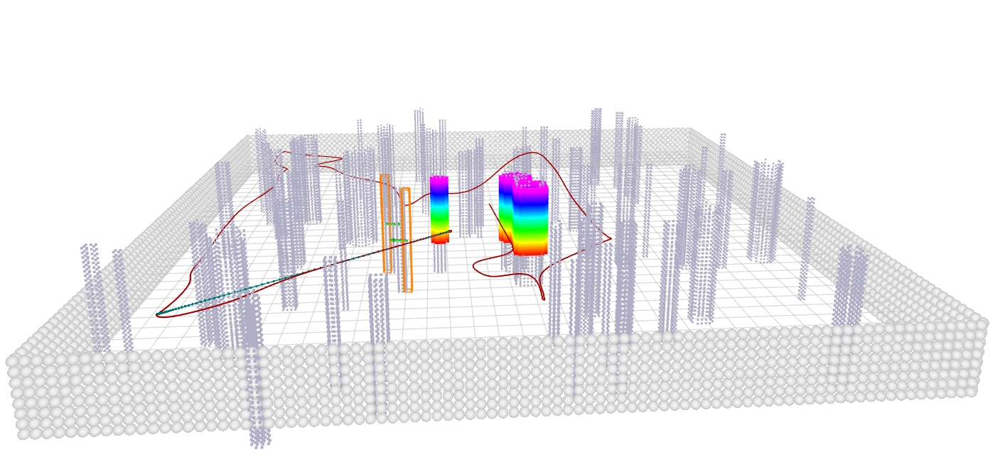
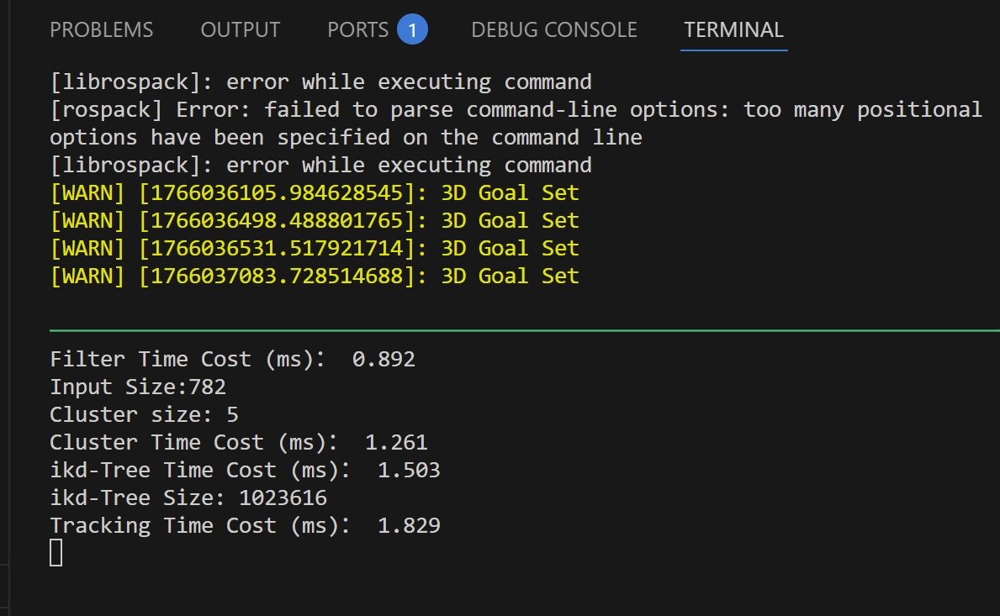
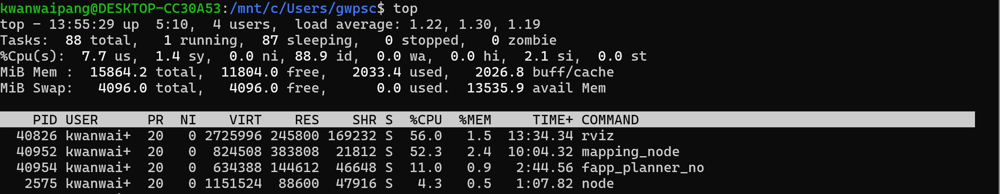

<div align="center">
<h1>代码学习——Fast and Adaptive Perception and Planning for UAVs in Dynamic Cluttered Environments</h1>
<a href="https://github.com/arclab-hku/FAPP">Original Github</a>
</div>


# 安装配置

```bash
sudo apt install python3-catkin-tools python3-osrf-pycommon

git clone git@github.com:R-C-Group/-Fast-and-Adaptive-Perception-and-Planning.git
cd FAPP 
catkin build

# source ~/catkin_ws/FAPP/devel/setup.bash
```

安装tmux

```bash
# install tmux
sudo apt install tmux
sudo apt install tmuxp
# kill a session (for example)
tmux kill-session -t fapp
```

运行demo

```bash
tmuxp load quick_start.yaml 
```

运行后则可以加载环境，并且环境中有移动物体/静态物体，通过设置`3D Nav Goal`可以实现导航及规划，同时也实时估算运动物体的速度。

<div align="center">
  
<figcaption>  
</figcaption>
</div>


实时性测试效果如下：5个物体，点云聚类耗时1.2ms，跟踪耗时1.8ms。

<div align="center">
  
<figcaption>  
</figcaption>
</div>

内存消耗情况如下：
* 处理器是11th Gen Intel(R) Core(TM) i7-11800H @ 2.30GHz (2.30 GHz)，机带RAM为32.0 GB
* 【CPU占用情况】
  * rviz (56.0% CPU): 占用了大约半个核心。
  * mapping_node (52.3% CPU): 建图节点。占用半个核心也属于正常范围。
  * fapp_planner_no (11.0% CPU): 路径规划节点。占用较低，运行稳定。
* 【内存占用情况】
  * 系统识别到的总内存约为 16GB。
  * mapping_node	383.8 MiB，fapp_planner	144.6 MiB


<div align="center">
  
<figcaption>  
</figcaption>
</div>